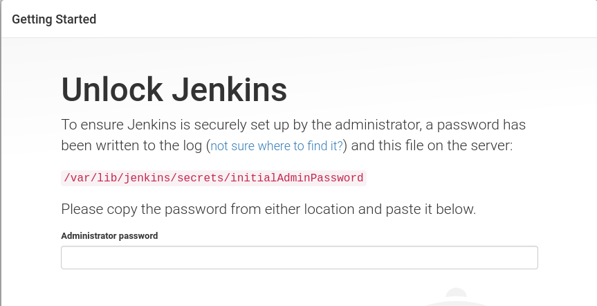
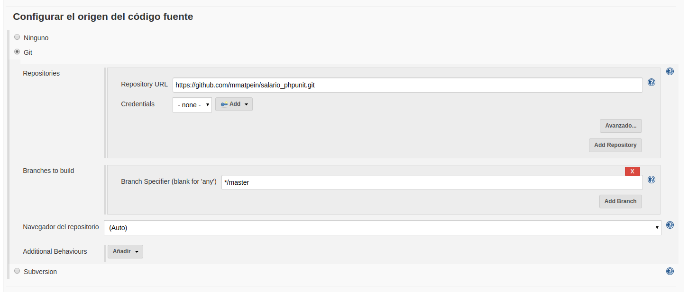
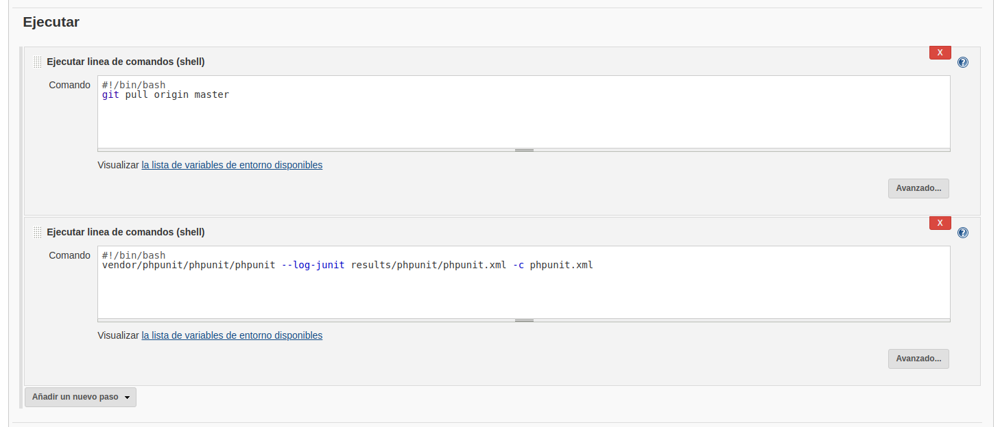
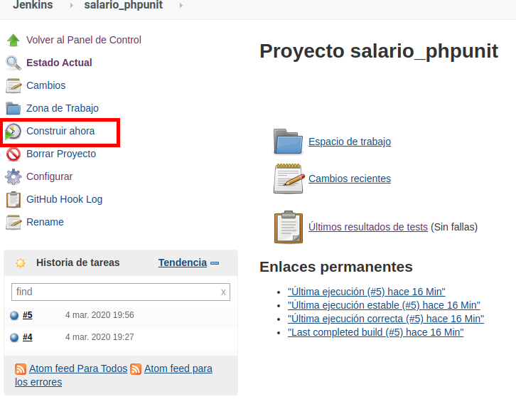
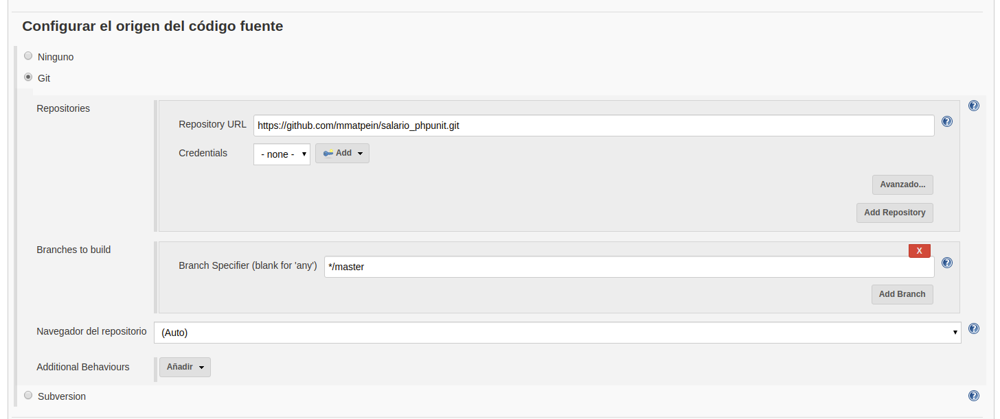
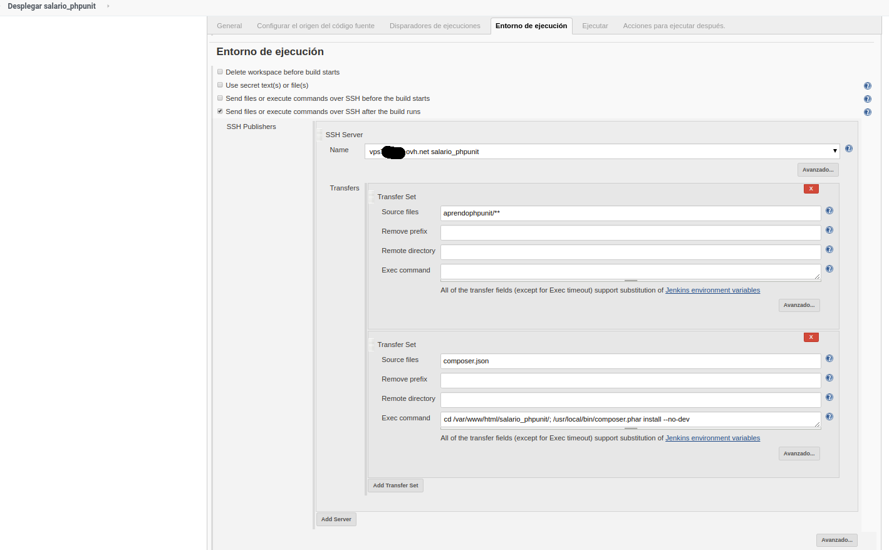
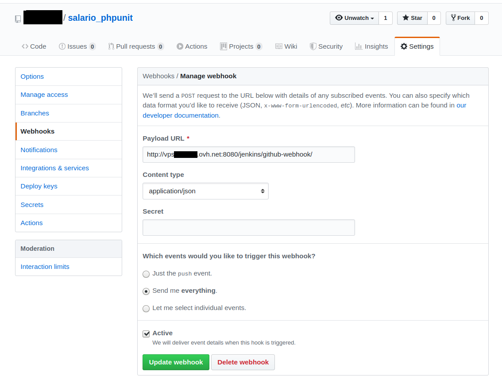

Despliegue de un proyecto PHP con Jenkins desde 0

# Jenkins

En los tiempos de los diagramas de Gantt, el diseño en cascada y la ingeniería del software tradicional, existía un periodo llamado fase de integración. En esta fase, las diferentes partes escritas por diferentes desarrolladores se colocaban juntas. Se producían problemas muy difíciles de prever, que a veces incluían la reescritura de una parte o de todo el programa. Esto producía retrasos, costes y clientes insatisfechos. La integracíón continua trata de solucionar estos problemas.

La integración continua, en su forma más simple, implica el uso de una o varias herramientas que monitorizan cambios en nuestro sistema de control de versiones. Si se detecta un cambio, la herramienta lleva a cabo las acciones para obtener una copia funcional del software (compila en caso de ser necesario) y realiza las pruebas necesarias. Si algo no va como debe, la herramienta genera informes automáticamente de forma que los desarrolladores puedan resolver el problema inmediatamente.

Además de esto, la C.I. (Continuous Integration) puede ayudar a controlar el nivel de calidad del software mediante herramientas de métricas y a automatizar el proceso de despliegue, permitiendo un proceso de desplegado automático o bien como un proceso de un click.

CI implica por tanto obtener un feedback más rápido, que permita solucionar problemas antes, en un proceso más suave para desarrolladores y para clientes.
Introducción de CI en una organización

La introducción de CI en una organización puede ser gradual, cubriendo solo algunas de sus aspectos e incrementando su grado de implementación progresivamente. Una secuenciación de la implantación de CI podría componerse de las siguientes fases:

- Sin servidor de construcción: el software es escrito y compilado por el programador en su ordenador, y no se actualiza en el repositorio siguiendo una base regular. Las pruebas las hace cada programador de manera independiente a los demás. Antes de cada liberación de nueva versión se realiza manualmente el proceso de integración, haciendo pruebas de este tipo. Esto puede ser bastante desagradable.
- Con servidor de construcción: el equipo cuenta con un servidor de construcción que realiza tareas de manera programada. En este proceso no necesariamente entra la ejecución de tests. La diferencia con la fase anterior radica en el envío de confirmaciones de código al repositirio regularmente (cada día por ejemplo). El servidor genera informes de conflicto, y el equipo podría utilizar el servidor unicamente con propósitos informativos exclusivamente.
- Con servidor de construcción y automatización de tests: además de compilar el software, se automatiza la ejecución de tests y publicación de resultados.
- Introducción de métricas: Además de los aspectos anteriores se utilizan herramientas para evaluar automáticamente la calidad del software y de las pruebas.
- Introducción de los tests en el proceso de desarrollo: aplicación de técnicas como TDD para aumentar la confianza en el software.
- Tests de aceptación y despliegue continuo: en esta fase se dedican esfuerzos a proporcionar información de manera continua sobre el estado del proyecto y que sea fácilmente interpretable por personas sin conocimientos técnicos. La aplicación es desplegada automáticamente en un entorno de pruebas, y desplegada en un entorno en producción cuando se considera preparada. También se puede hacer un rollback a una versión anterior en caso de que algo vaya mal.
- Despliegue continuo: cuando el nivel de confianza en el proceso de automatización es suficientemente alto, se pueden aplicar técnicas de automatización para el despliegue, para éste ocurra automáticamente.

## Instalación

Para la instalación de Jenkins vamos a utilizar inicialmente un servidor Ubuntu (no tiene por qué ser de esta distribución) en una máquina virtual local.

Más adelante podríamos utilizar una VPS para instalar Jenkins y usarlo como servidor de integración, de despliegue y de producción (aunque lo más recomendable sería que el servidor de CI no fuese el mismo que el de producción).

### Instalación de Jenkins en Linux (local)

En máquinas con la distribución Linux Ubuntu instalada podemos utilizar los paquetes oficiales siguiendo los comandos:

wget -q -O - https://jenkins-ci.org/debian/jenkins-ci.org.key | sudo apt-key add -
sudo sh -c 'echo deb http://pkg.jenkins-ci.org/debian binary/ 
            > /etc/apt/sources.list.d/jenkins.list'
sudo apt-get update
sudo apt-get install jenkins

Para más información sobre la instalación recomendamos visitar la documentación oficial Jenkins:[https://www.jenkins.io/doc/](https://www.jenkins.io/doc/)

Una vez instalado Jenkins podemos acceder a la aplicación abriendo un navegador y accediendo a la url http://localhost:8080, que es la configuración por defecto.

### Instalación de un servidor Tomcat (otra opción disponible, no la usaremos inicialmente)

El proceso de instalación de un servidor Tomcat queda descrito en [https://ubunlog.com/tomcat-9-instalacion-ubuntu-18-04/](https://ubunlog.com/tomcat-9-instalacion-ubuntu-18-04/).

### Instalación de Apache y PHP

Apache y PHP ejecutarán el proyecto cuando este sea desplegado, así que lo vamos a necesitar para más adelante.

> Será necesario instalar *php-xml* (si no, phpunit dará fallo: Class 'DOMDocument' not found), también *php-mbstring* (si no, composer install no funcionará)

### Despliegue de Jenkins

Para desplegar Jenkins, basta con colocar el archvio [jenkins.war](https://jenkins.io/download/) en la carpeta *webapps* del servidor Tomcat (si has seguido la información sugerida estará en */opt/tomcat/latest/webapps/*). Una forma sencilla de hacer esto es abriendo una sesión ssh en el servidor, colocándonos en la carpeta */opt/tomcat/latest/webapps* y ejecutando el comando *http://mirrors.jenkins.io/war/latest/jenkins.war*. Una vez que se despliegue, será accesible desde la URL *http://tu_servidor:8080/jenkins*.

> Otra opción es utilizar un instalable específico para el sistema operativo que utilices. Puedes encontrar instrucciones en [https://jenkins.io/doc/book/installing/](https://jenkins.io/doc/book/installing/)

### Comenzar

En primer lugar hay que acceder al servidor. Si ha sido configurado bajo Tomcat, la URL será *http://tu_servidor/jenkins/*. A continuación hay que desbloquear Jenkins. La imagen muestra información suficiente sobre lo que hay que hacer.

Después, se deben instalar plugins para que Jenkins tenga auténtica utilidad. Los plugins de partida pueden ser suficientes en un principio. Más adelante se pueden instalar nuevos plugins y desinstalar los ya instalados.

Finalmente, crearemos un usuario.

### Configurar un usuario con permisos de administrador

Desde la página principal, accedemos a *Administrar Jenkins / Configuración global de la seguridad*. Allí, se puede configurar Jenkins para que el usuario creado inicialmente tenga permisos de administración del sistema.

### Crear nuestra primera tarea

Para explicar cómo se puede desplegar una aplicación con Jenkins, podemos usar un sencillo código de ejemplo en [https://github.com/mmatpein/salario_phpunit](https://github.com/mmatpein/salario_phpunit). El primer paso sería añadir una nueva tarea. Para añadir una tarea, basta con pulsar en *nueva tarea* en la página principal de Jenkins

#### La tarea de testing

Esta primera tarea descargará el proyecto desde GitHub, y después ejecutará las pruebas de PHPUnit. Los resultados de las pruebas se almacenarán en el servidor para que puedan consultarse cómodamente en Jenkins.

En esta tarea hay varios aspectos a configurar. En primer lugar debemos indicar la URL del repositorio y la rama de interés.

A continuación se debe crear una tarea, para ejecutar el comando *git pull* (equivalente a hacer *git fetch/merge*). El proyecto se descargará a la carpeta */opt/tomcat/.jenkins/workspace/*. 

> Es preciso que el servidor tenga instalado *git*.

Ademáss, se deben configurar las pruebas a realizar. En este caso, se indica el archivo donde se volcarán los resultados. Jenkins está preparado para interpretar estos datos. El comando correspondiente *phpunit*, incluye la opción *--log-junit /results/phpunit/phpunit.xml*.

Finalmente, en la sección *Acciones para ejecutar después* debemos indicar en qué lugar se encontrarán los resultados.

En la siguiente captura puede verse observarse cómo, después de ejecutar esta tarea se crea la carpeta *results* que incluye los resultados de las pruebas.

Aunque no es lo más práctico, una tarea puede ser ejecutada manualmente. Aunque se puede hacer así, resulta más conveninete configurar la tarea para que se dispare seguiendo algún criterio, como por ejemplo, la subida del proyecto a *GitHub*.

En la siguiente imagen se puede observar cómo Jenkins muestra los resultados de los tests.

La tarea configurada hasta el momento incluye únicamente para realizar las pruebas sobre el proyecto. Pero también será necesaria una tarea para el despliegue el proyecto en el servidor de preproducción. El nombre elegido para esta tarea es *Desplegar salario_phpunit*

#### La tarea de testing

Una vez que el proyecto ha sido testeado, si el resultado es satisfactorio, puede desplegarse a un servidor de preproducción. Este servidor no tiene porqué ser el mismo que donde está Jenkins instalado. El proyecto que se desplegará no será igual que el proyecto alojado en GitHub. En concreto, **no incluirá las pruebas de PHPUnit, no las dependencias que sean de desarrollo**.

> En el archivo *composer.json* las dependencias se especifican en la sección "require-dev"
 
Como primera configuración, indicamos el origen del proyecto (en GitHub).

Para poder publicar usando SSH, es necesario instalar el plugin *publish over ssh plugin*. Hasta que no lo hagamos, Jenkins no ofrecerá la opción de enviar por ssh los archivos del proyecto desplegado. Los archivos serán enviados a la carpeta donde el servidor. 

En el siguiente paso, configuraremos el envío por SSH de los archivos del proyecto al servidor de pre-producción. 

> ¡OJO! Composer debe estar instalado en el sistema. En [https://getcomposer.org/download/](https://getcomposer.org/download/) hay instrucciones sobre cómo descargar el archivo *composer.phar*. En mi caso, he elegido colocar el archivo en la carpeta */usr/local/bin/* del servidor en producción (que en mi caso es el mismo que el servidor de testing).

Además, ejecutaremos el *script* de *composer* para que se descarguen las dependencias **no-de-desarrollo**. Esa es la razón de que el comando *composer* incluye la opción *--no-dev*. 

En este punto podemos probar la tarea, para ver si se ejectua correctamente, y el proyecto termina desplegado en el servidor de preproducción.

### Disparo de las tareas de testeo y despligue por actualización de repositorio

Una vez comprobamos que la tarea funciona correctamente, volvemos a la tarea de testeo y la configuramos para que en caso de que los tests sean correctos, lancemos la tarea de despliegue.

En la configuración de Jenkins, hay un apartado relacionado con GitHub, llamada *GitHub Servers*. En el botón *?* se ofrece información sobre la URL donde Jenkins recibirá las notificaciones enviadas por GitHub.

Para que *GitHub* envíe notificaciones a Jenkins, debemos ir a la configuración del repositorio, a la sección Webhooks e indicar la URL donde Jenkins debe las recibirá.

Con lo anterior, Jenkins recibe las notificaciones de GitHub. Pero falta indicarle a la tarea, que llegada la notificación, se disare, concluyendo así la automaticación del despliegue.

### Recapitulando

A partir de este momento, cada vez que hagamos un *push* al proyecto en GitHub, Jenkins se pondrá en marcha. El proceso que se seguirá será el siguiente:

1. El webhook de GitHub enviará una notificación JSON al servidor Jenkins. El servidor tomará esta información y lanzará la primera tarea.
2. La primera tarea descarga el proyecto desde GitHub mediante el comando *pull* o *fetch/merge*.
3. Una que vez que se ha descargado, ejecutará las tareas de PHPUnit y los resultados se almacenarán en un archivo XML.
4. Si el resultado es verde, se ejecutará la siguiente tarea de despliegue.
5. La segunda tarea envia por SSH los archivos de código y el archivo *composer.json* al servidor de preproducción.
6. Después, en dicho servidor (que en el ejemplo resulta ser el mismo... no hay presupuesto para tanta VPS (｡●́‿●̀｡)) se instalan las dependencias no-de-desarrollo, que serán necesarias para que el código pueda ejecutarse.

---------------------------------------------

Actividad final. Escribe una aplicación llamada ecuación. Esta aplicación calcula la tabla de valores de una ecuación de segundo grado. Como entrada se facilitarán los coeficientes a, b y c de una ecuación cuadrática con la forma *a + bx + cx²*. Como resultado, se mostrará por pantalla una tabla como la siguiente (para la ecuación 2x² + 3x + 5):

x | y
--|---
0 | 5
1 | 12
2 | 19
3 | 26
4 | 33
5 | 40
6 | 47
7 | 54
8 | 61
9 | 68
10| 75

> Para el cálculo debe utilizarse una clase en PHP llamada EcuacionGrado2. 

El objetivo del ejercicio es el siguiente:

1. Crear una página llamada index.html que incluya un formulario para introducir los coeficientes a, b y c. Esta página debe enviar los datos via AJAX al backend.
2. En el backend habrá el código necesario para calcular la tabla de la ecuación. El resultado será enviado mediante JSON al frontend, que mostrará la tabla con los valores obtenidos.
3. El backend contará con casos de prueba para comprobar que la clase *EcuacionGrado2* funciona correctamente. Debe utilizarse Composer para la instalación de las dependecias (en este caso PHPUnit como mínimo y cualquier otra dependencia que se considere necesario).
4. Configurar un servidor Jenkins para automatizar el proceso de despliegue del proyecto. El proceso de integración descargará desde GitHub el proyecto, ejecutará los casos de prueba y mostrará los resultados de los casos de prueba. Una vez que los casos de prueba sean ejecutados, si éstos están en verde, se desplegarán en el servidor web de preproducción (que puede estar en la misma máquina).

Entregar:

1. El repositorio de GitHub donde está el proyecto.
2. Una memoria de la configuración de Jenkins, de un modo similar a como está expuesto en este documento, con las aclaracioness necesarias.
